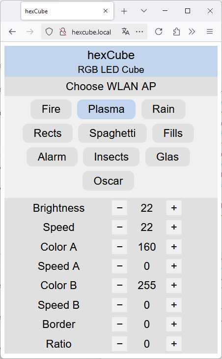
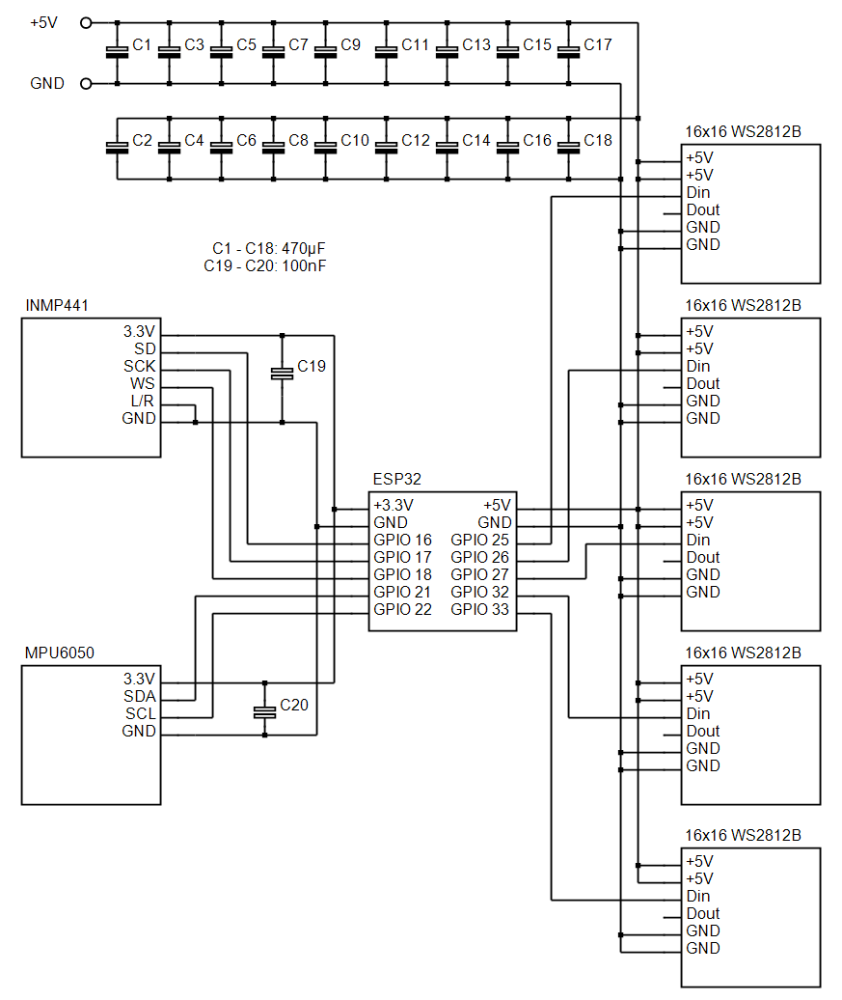
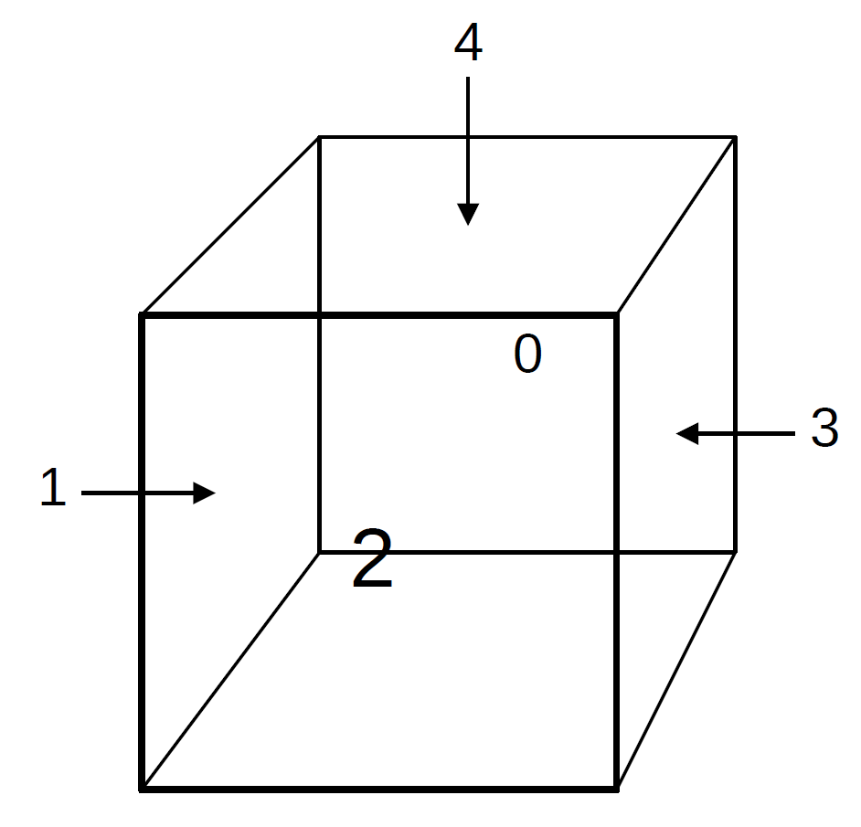
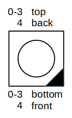

# hexCube
ESP32 based 5x16x16 RGB Matrix Cube
#### Features
* uses 5x16x16 WS2812 RGB LED
* uses MPU6050 as 3-Axis Gyroscope and Accelerometer
* uses INMP441 as I2S Microphone
* controllable via WebUI
* works as WLAN client and AP (AP chooser included)
* WebUI with IP address 192.168.4.1
* mDNS hostname hexCube.local
* DNS hostname hexCube.local (WLAN AP mode only)
#### GPIO LED Matrix
* GPIO 25 - 16x16 Matrix 0
* GPIO 26 - 16x16 Matrix 1
* GPIO 27 - 16x16 Matrix 2
* GPIO 32 - 16x16 Matrix 3
* GPIO 33 - 16x16 Matrix 4
#### GPIO MPU6050 (I2C)
* GPIO 21 - SDA
* GPIO 22 - SCL
#### GPIO INMP441 (I2S)
* GPIO 16 - SD
* GPIO 17 - SCK
* GPIO 18 - WS
#### Development Hardware
[Example Video](https://www.youtube.com/watch?v=KOOkoH9jpKM)
-[ Fire ](https://www.youtube.com/shorts/TXOvpcaWYJA)
-[ Plasma ](https://www.youtube.com/shorts/llILyVM4B7A)

#### Web UI

#### Schematic

#### Matrix orientation

#### LED orientation
